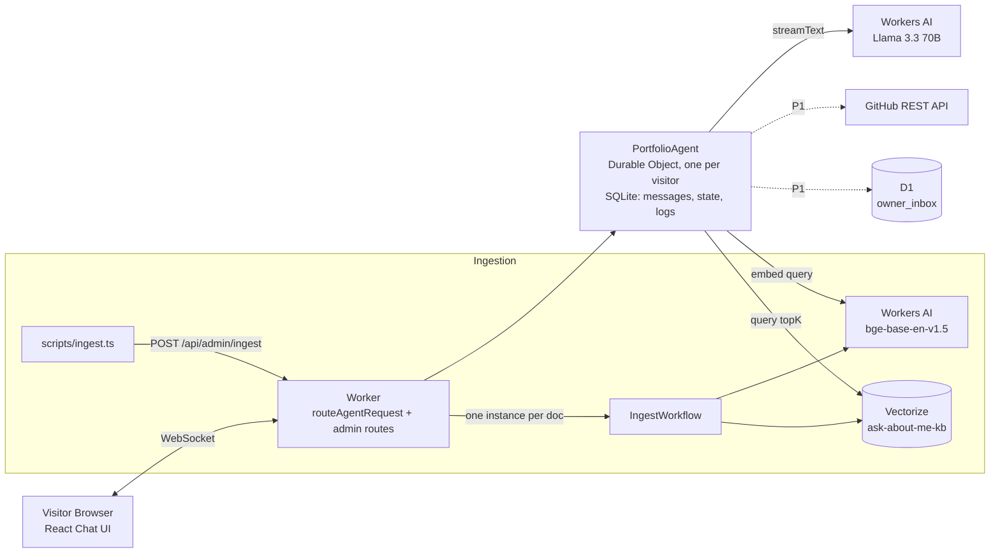

# Ask-About-Me — AI Portfolio Concierge

> A public chat agent, running entirely on Cloudflare, that answers recruiter and engineer questions about **Anirban Sarkar**'s background using retrieval over resume, projects, and writing, with cited sources, per-visitor persistent memory, and zero external API keys.

---

## 1. Live Demo

- **Live Demo URL:** `https://ask-about-me.<subdomain>.workers.dev` *(deployment in progress)*
- **GitHub Repository:** [https://github.com/Anirban780/Cloudflare---Ask-About-Me](https://github.com/Anirban780/Cloudflare---Ask-About-Me)

---

## 2. Cloudflare Assignment Mapping

| Cloudflare Form Requirement | How This Project Satisfies It | Cloudflare Primitive |
|---|---|---|
| **LLM (Llama 3.3 on Workers AI)** | `@cf/meta/llama-3.3-70b-instruct-fp8-fast` via `workers-ai-provider` & Vercel AI SDK | Workers AI (`env.AI` binding) |
| **Workflow / Coordination** | One stateful agent per visitor coordinates chat, tools, memory; durable ingestion pipeline | Cloudflare Agents SDK on Durable Objects + Cloudflare Workflows |
| **User Input (Chat / Voice)** | Fast streaming chat UI over WebSocket | React chat UI served directly by the Worker |
| **Memory or State** | Per-visitor memory in SQLite; knowledge memory in vector index | Durable Object SQLite + `setState`, Vectorize |

---

## 3. Architecture



### Life of a Chat Turn

1. **Visitor message:** Browser sends message via WebSocket to visitor's dedicated Durable Object (`PortfolioAgent`).
2. **Safety guardrails:** Agent checks per-visitor rate limits (max 30 msgs/hr) and input length (≤ 1,000 chars).
3. **Model invocation:** Agent invokes `@cf/meta/llama-3.3-70b-instruct-fp8-fast` with system prompt, visitor profile, chat history, and tools.
4. **Retrieval tool:** For questions about Anirban's background, the model calls `searchKnowledgeBase`. The query is embedded using `@cf/baai/bge-base-en-v1.5` (768 dims) and queried against Vectorize.
5. **Grounded generation:** Chunks returned to the model with numbered references `[1]..[n]`. The model streams back answers with inline citations.
6. **Streaming UI:** Tokens and citations stream to the visitor in real time.

---

## 4. Key Design Decisions

- **Durable Object per visitor:** Complete state isolation, zero cross-talk, per-visitor memory and natural rate limiting.
- **Workers AI Only (Zero External Keys):** 100% native Cloudflare execution without OpenAI/Anthropic keys.
- **Chunk text stored in Vectorize metadata:** Eliminates need for auxiliary database lookups during retrieval.
- **Cloudflare Workflows for Ingestion:** Ingestion is durable, chunked, and retried automatically.
- **Honest refusal and third-person persona:** The agent never impersonates Anirban and never hallucinates facts outside the retrieved knowledge base.

---

## 5. Evaluation Results

- **Retrieval Hit@5:** Target ≥ 85% on 20+ golden questions *(to be recorded in Slice S8)*
- **Hallucination Bait Set:** Target 0/8 invented facts or instruction leaks *(to be recorded in Slice S8)*

---

## 6. Setup & Local Development

### Prerequisites

- Node.js 22 LTS (via `nvm`)
- Cloudflare Wrangler CLI (`npm install -g wrangler` or `npx wrangler`)

### Running Locally

```bash
# 1. Clone repository
git clone https://github.com/Anirban780/Cloudflare---Ask-About-Me.git
cd Cloudflare---Ask-About-Me

# 2. Install dependencies
npm install

# 3. Cloudflare authentication (required for Workers AI remote binding)
npx wrangler login

# 4. Generate types
npm run types

# 5. Typecheck & start development server
npm run typecheck
npm run dev
```

---

## 7. AI-Assisted Development & Prompt History

Per the Cloudflare application guidelines, all AI coding history is fully preserved:
- Master prompt index: [`PROMPTS.md`](./PROMPTS.md)
- Raw session transcripts: [`prompt-history/`](./prompt-history/)
- Change tracking log: [`PROJECT_STEPS.md`](./PROJECT_STEPS.md)
