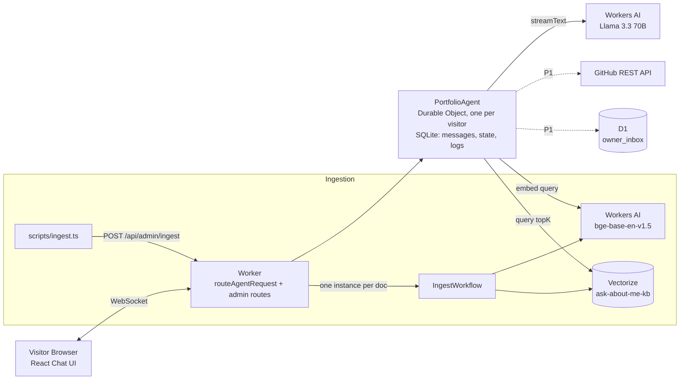

# High-Level Implementation Plan — Ask-About-Me

> **Project:** Ask-About-Me — AI Portfolio Concierge on Cloudflare
> **Author:** Senior Tech Lead (AI-assisted session, 2026-09-19)
> **Status:** DRAFT — Awaiting human approval before any code is written

---

## 1. Executive Summary

Ask-About-Me is a RAG-powered AI portfolio concierge that runs **entirely on Cloudflare** — Workers, Durable Objects, Workers AI (Llama 3.3 70B), Vectorize, and Workflows. It answers recruiter and engineer questions about the owner's background using retrieval over their resume, projects, and writing, with cited sources, per-visitor persistent memory, and zero external API keys.

This plan breaks the build into **11 slices (S0–S10)** across ~14–20 focused hours.

---

## 2. Architecture Overview

### Key Data Flow — One Chat Turn

1. Visitor sends message via WebSocket
2. PortfolioAgent (Durable Object) checks rate limits & input caps
3. System prompt + visitor context + history + tools → Llama 3.3
4. Model calls `searchKnowledgeBase` tool → embed query → Vectorize lookup
5. Results returned to model with numbered citations
6. Model generates streamed answer with `[n]` citations
7. Tokens streamed back to browser

---

## 3. Complete File Manifest

### Root Files

| File | Purpose | Created In |
|------|---------|-----------|
| `CLAUDE.md` | Thin pointer for Claude Code agents | S1 |
| `AGENTS.md` | Thin pointer for other agents | S1 |
| `README.md` | Project documentation (outline in SPECS §15.1) | S1 (skeleton), S10 (final) |
| `PROMPTS.md` | Prompt history index (submission requirement) | S0 ✅ |
| `PROJECT_STEPS.md` | Change tracker | S0 ✅ |
| `package.json` | Dependencies & scripts | S0 (from starter) |
| `wrangler.jsonc` | Cloudflare bindings & config | S0 (starter), S2–S5 (additions) |
| `tsconfig.json` | TypeScript configuration | S0 (from starter) |
| `vite.config.ts` | Vite build config | S0 (from starter) |
| `env.d.ts` | Generated by `wrangler types` | S0, regenerated after binding changes |
| `.gitignore` | Ignore secrets, node_modules, dist | S1 |
| `.dev.vars.example` | Example env vars (no secrets) | S1 |

### `docs/` — Project Documentation

| File | Purpose | Created In |
|------|---------|-----------|
| `docs/PROJECT_SCOPE.md` | What and why | S0 ✅ |
| `docs/SPECS.md` | Exact technical how | S0 ✅ |
| `docs/SKILLS.md` | Rules, recipes, gotchas | S0 ✅ |
| `docs/PROJECT_INPUTS.md` | Filled placeholders (owner name, etc.) | S1 |
| `docs/BACKLOG.md` | Out-of-scope ideas | S0 ✅ |
| `docs/plans/IMPLEMENTATION_PLAN.md` | This file | S0 ✅ |
| `docs/plans/PACKAGES.md` | Dependency manifest & cleanup | S0 ✅ |
| `docs/plans/S00.md` – `docs/plans/S10.md` | Per-slice plans | Before each slice |
| `docs/reference/VERSIONS.md` | `npm ls` output of key packages | S0 |
| `docs/reference/VERIFIED.md` | Answers to SPECS §16 verify list | S1+, ongoing |
| `docs/reference/*.md` | Downloaded Cloudflare/SDK docs | S1 |

### `src/` — Application Source

| File | Purpose | Created In |
|------|---------|-----------|
| `src/server.ts` | Worker entry: exports, routing, admin API | S0 (starter), S2+ (modified) |
| `src/config.ts` | Constants (chunk sizes, limits, thresholds) | S3 |
| `src/agent/portfolio-agent.ts` | `PortfolioAgent` class (AIChatAgent subclass) | S2 |
| `src/agent/system-prompt.ts` | System prompt builder | S2 |
| `src/agent/tools.ts` | Tool definitions (search, remember, GitHub, leave message) | S6 (P0), S9 (P1) |
| `src/agent/guards.ts` | Rate limit, input caps, guard logic | S7 |
| `src/rag/chunker.ts` | Pure markdown chunking function | S3 |
| `src/rag/embed.ts` | Embedding helper | S5 |
| `src/rag/retrieve.ts` | Retrieval logic (embed → query → filter → rank) | S6 |
| `src/workflows/ingest-workflow.ts` | `IngestWorkflow` class (WorkflowEntrypoint) | S5 |
| `src/app.tsx` | React chat UI (from starter, rebranded) | S0 (starter), S2+ (modified) |
| `src/client.tsx` | Client entry (from starter) | S0 (starter) |
| `src/styles.css` | Styles (from starter, extended) | S0 (starter), S2+ |
| `src/components/SourceChips.tsx` | Citation chip component | S6 |
| `src/components/MemoryChip.tsx` | Visitor memory display + forget | S7 |
| `src/components/SuggestionChips.tsx` | Empty-state question suggestions | S7 or S9 |

### `test/` — Unit Tests

| File | Purpose | Created In |
|------|---------|-----------|
| `test/chunker.test.ts` | Chunker properties from SPECS §6.3 | S3 |
| `test/guards.test.ts` | Rate limit, input cap boundary tests | S7 |
| `test/citations.test.ts` | `[n]` parser edge cases | S6 |

### `evals/` — Evaluation

| File | Purpose | Created In |
|------|---------|-----------|
| `evals/golden.json` | ≥20 retrieval questions + expected docIds | S8 |
| `evals/bait.json` | 8 hallucination/injection bait prompts | S8 |
| `evals/run-retrieval-eval.ts` | Eval runner (calls search-debug, reports hit@k) | S8 |
| `evals/results.md` | Latest eval run output | S8, updated ongoing |

### `scripts/` — CLI Utilities

| File | Purpose | Created In |
|------|---------|-----------|
| `scripts/ingest.ts` | Knowledge ingestion CLI (reads /knowledge, POSTs to admin endpoint) | S5 |

### `knowledge/` — Source Documents (Owner Must Provide)

| File | Purpose | Created In |
|------|---------|-----------|
| `knowledge/resume.md` | Full resume in markdown | S5 (owner provides) |
| `knowledge/about.md` | 200–400 word "who I am" | S5 (owner provides) |
| `knowledge/projects/*.md` | 3–5 project write-ups (≥150 words each) | S5 (owner provides) |

### `prompt-history/` — Raw Session Transcripts

| File | Purpose | Created In |
|------|---------|-----------|
| `prompt-history/YYYY-MM-DD-Snn-tool.md` | Raw transcript per session | Every session end |

---

## 4. Slice-by-Slice Implementation Plan

### S0 — Baseline (1 hour)

**Goal:** Scaffold from `cloudflare/agents-starter`, run locally, deploy untouched.

**Steps:**
1. Clone or `npm create cloudflare@latest` with the agents starter template
2. `npm install`
3. `npx wrangler login`
4. `npm run dev` — verify starter chat works locally
5. `npm run deploy` — verify on `workers.dev` URL
6. Record `npm ls agents @cloudflare/ai-chat ai workers-ai-provider wrangler zod` → `docs/reference/VERSIONS.md`

**Exit Criteria:** Live URL from the starter; versions recorded; docs in place.

---

### S1 — Repo Hygiene (0.5 hours)

**Goal:** Proper documentation structure, agent pointer files, git hygiene.

**Steps:**
1. Move docs into `docs/` (already done ✅)
2. Create `CLAUDE.md` and `AGENTS.md` at repo root (pointer content from SKILLS §0)
3. Set up `.gitignore` (include `.dev.vars`, `.env`, `node_modules`, `dist`)
4. Create `.dev.vars.example` with placeholder `ADMIN_TOKEN=change-me`
5. Create `docs/PROJECT_INPUTS.md` — template for owner placeholders
6. Download reference docs into `docs/reference/` (list in SKILLS §6)
7. Create `docs/reference/VERIFIED.md` — template for SPECS §16 answers

**Exit Criteria:** Agent reads docs; no secrets tracked; `.gitignore` covers all sensitive files.

---

### S2 — Llama 3.3 Persona (1–2 hours)

**Goal:** Switch model to Llama 3.3, create persona prompt, remove starter demo tools, rebrand UI.

**Steps:**
1. Set `CHAT_MODEL` var in `wrangler.jsonc`
2. Create `src/agent/portfolio-agent.ts` — subclass `AIChatAgent`
3. Create `src/agent/system-prompt.ts` — persona prompt from SPECS §8.2
4. Remove demo tools (`getWeather`, `calculate`, scheduling, `executeTask`)
5. Update `src/server.ts` — export new agent, route correctly
6. Rebrand `src/app.tsx` — header, title, agent name
7. Deploy and verify streaming chat with persona

**Exit Criteria:** Persona chat works; no demo tools remain; deployed.

---

### S3 — Chunker + Tests (1–2 hours)

**Goal:** Pure markdown chunking function with comprehensive tests.

**Steps:**
1. Create `src/config.ts` — all constants from SPECS §5.4
2. Create `src/rag/chunker.ts` — implement algorithm from SPECS §6.3
3. Create `test/chunker.test.ts` — all 9 properties from SPECS §6.3
4. Run `npm test` — all green

**Exit Criteria:** All §6.3 test properties pass.

---

### S4 — Infrastructure Bindings (1 hour)

**Goal:** Vectorize index, metadata index, bindings, health route.

**Steps:**
1. Run infra commands: `wrangler vectorize create`, metadata index
2. Add Vectorize binding to `wrangler.jsonc`
3. Add Workflow binding to `wrangler.jsonc`
4. `npx wrangler types` → regenerate `env.d.ts`
5. Add `/api/health` route in `src/server.ts`
6. Deploy and verify health reports Vectorize ready

**Exit Criteria:** Health route works locally and deployed.

---

### S5 — Ingestion Pipeline (3–4 hours)

**Goal:** Durable ingestion workflow — chunk, embed, upsert to Vectorize.

**Steps:**
1. Create `src/rag/embed.ts` — embedding helper
2. Create `src/workflows/ingest-workflow.ts` — `IngestWorkflow` class
3. Add admin ingest routes to `src/server.ts` (POST + GET status)
4. Create `scripts/ingest.ts` — CLI that reads `/knowledge` and POSTs
5. Create initial knowledge documents (owner must provide)
6. Run ingest, verify via `search-debug` endpoint
7. Verify idempotency — re-run ingest, vector count unchanged

**Exit Criteria:** F-03 acceptance passes; `search-debug` returns sensible matches.

---

### S6 — RAG Tool + Citations (2–3 hours)

**Goal:** Tool-based retrieval with citations and refusal behavior.

**Steps:**
1. Create `src/rag/retrieve.ts` — retrieval logic from SPECS §7
2. Create `src/agent/tools.ts` — `searchKnowledgeBase` tool
3. Update system prompt — add grounding rules
4. Create `src/components/SourceChips.tsx` — citation UI
5. Create `test/citations.test.ts` — `[n]` parser tests
6. Test refusal behavior with bait prompts (manual)

**Exit Criteria:** F-04, F-05 (manual), F-15 basics pass.

---

### S7 — Memory + Guardrails (2 hours)

**Goal:** Visitor memory, rate limiting, input caps, forget-me.

**Steps:**
1. Add SQLite tables to `portfolio-agent.ts` `onStart`
2. Create `src/agent/guards.ts` — rate limit, input cap logic
3. Create `test/guards.test.ts` — boundary tests
4. Add `rememberVisitorContext` tool to `tools.ts`
5. Create `src/components/MemoryChip.tsx` — memory display + forget
6. Add `@callable() forgetVisitor()` to agent
7. Create `src/components/SuggestionChips.tsx` (if time)

**Exit Criteria:** F-06, F-07, F-09, F-14 pass.

---

### S8 — Evals (1–2 hours)

**Goal:** Golden retrieval set, bait test suite, tune thresholds.

**Steps:**
1. Write `evals/golden.json` — ≥20 questions with expected docIds
2. Write `evals/bait.json` — 8 hallucination/injection prompts
3. Create `evals/run-retrieval-eval.ts` — eval runner
4. Run eval, tune `MIN_SCORE` / `TOP_K` / chunk params
5. Record results in `evals/results.md`
6. Achieve ≥85% hit@5

**Exit Criteria:** Success criteria 2 and 3 met; numbers recorded.

---

### S9 — P1 Features (2–3 hours, pick ≥2)

**Goal:** At least two P1 features from F-11 to F-16.

**Recommended picks:**
- **F-11** `getGitHubProjects` — live repo data tool
- **F-12** `leaveMessageForOwner` — human-in-the-loop message tool (requires D1)
- **F-15** UI polish — suggestion chips, citation chips with expand, memory chip

**Steps per feature:** Plan → implement → test → verify acceptance criteria.

**Exit Criteria:** Acceptance criteria for chosen features pass.

---

### S10 — Ship (2–3 hours)

**Goal:** Polish, README, decision log, final QA, submit.

**Steps:**
1. Complete README per SPECS §15.1 outline
2. Update decision log in SPECS §17
3. Final `npm run eval` — record numbers
4. Deploy final version
5. Smoke test deployed URL in incognito (desktop + 360px)
6. Run bait suite against deployed URL
7. Verify `PROMPTS.md` is complete
8. Check no secrets in git history
9. Make repo public
10. Fill submission form

**Exit Criteria:** Definition of Done (PROJECT_SCOPE §11) complete.

---

## 5. Cloudflare Resources Required

| Resource | Command to Create | When | Command to Delete |
|----------|-------------------|------|-------------------|
| Workers AI binding | Automatic via `wrangler.jsonc` `"ai"` | S0 | Remove from `wrangler.jsonc` |
| Vectorize index `ask-about-me-kb` | `npx wrangler vectorize create ask-about-me-kb --dimensions=768 --metric=cosine` | S4 | `npx wrangler vectorize delete ask-about-me-kb` |
| Vectorize metadata index | `npx wrangler vectorize create-metadata-index ask-about-me-kb --property-name=sourceType --type=string` | S4 | Deleted with the index |
| Durable Object (PortfolioAgent) | Automatic via `wrangler.jsonc` migration | S2 | Remove from `wrangler.jsonc`, delete Worker |
| Workflow (IngestWorkflow) | Automatic via `wrangler.jsonc` | S5 | Remove from `wrangler.jsonc` |
| D1 database (P1 only) | `npx wrangler d1 create ask-about-me-db` | S9 | `npx wrangler d1 delete ask-about-me-db` |
| Worker deployment | `npm run deploy` | S0+ | `npx wrangler delete ask-about-me` |
| Secret `ADMIN_TOKEN` | `npx wrangler secret put ADMIN_TOKEN` | S4 | `npx wrangler secret delete ADMIN_TOKEN` |

---

## 6. Risk Mitigations Embedded in the Plan

| Risk | Mitigation in this plan |
|------|-------------------------|
| Outdated SDK syntax (R1) | Verify-before-use list (SPECS §16); reference docs in S1; never guess an API |
| Llama tool calling flaky (R2) | `RETRIEVAL_MODE=always` fallback built into S6 |
| Quota exhaustion (R3) | Rate limit + output cap in S7; friendly error paths |
| Invented facts (R4) | Grounding rules in S2; bait tests in S8 |
| Scope creep (R7) | P0 freeze; ideas → BACKLOG.md; slices are atomic |
| Prompt history missing (R9) | PROMPTS.md from session 1; updated every session |
| Works locally, fails deployed (R10) | Deploy + smoke test at S0, S4, S5, S10 |

---

## 7. Time Estimate Summary

| Slice | Estimated Hours |
|-------|----------------|
| S0 Baseline | 1 |
| S1 Repo Hygiene | 0.5 |
| S2 Persona Agent | 1.5 |
| S3 Chunker + Tests | 1.5 |
| S4 Infra Bindings | 1 |
| S5 Ingestion Pipeline | 3.5 |
| S6 RAG + Citations | 2.5 |
| S7 Memory + Guards | 2 |
| S8 Evals | 1.5 |
| S9 P1 Features | 2.5 |
| S10 Ship | 2.5 |
| **Total** | **~20** |

---

## 8. Definition of Done (from PROJECT_SCOPE §11)

- [ ] All P0 features (F-01 to F-10) meet their acceptance criteria
- [ ] At least two P1 features done and tested
- [ ] `npm run typecheck`, `npm test`, and `npm run eval` pass on a clean clone
- [ ] Deployed URL verified in incognito on desktop and mobile widths
- [ ] Bait tests re-run against the deployed URL after final deploy
- [ ] README complete (per SPECS §15.1)
- [ ] `PROMPTS.md` plus `/prompt-history` committed
- [ ] No secrets in repo or git history
- [ ] Repo is public and URL ready for submission

---

> **Next Action:** Fill `docs/PROJECT_INPUTS.md` with owner details, then proceed to Slice S0.
